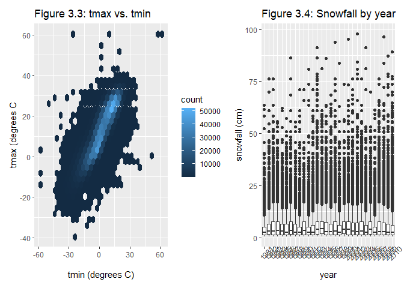

HW3
================
Xuesen Zhao
2022-10-08

``` r
library(tidyverse)
```

    ## ── Attaching packages ─────────────────────────────────────── tidyverse 1.3.2 ──
    ## ✔ ggplot2 3.3.6      ✔ purrr   0.3.4 
    ## ✔ tibble  3.1.8      ✔ dplyr   1.0.10
    ## ✔ tidyr   1.2.1      ✔ stringr 1.4.1 
    ## ✔ readr   2.1.2      ✔ forcats 0.5.2 
    ## ── Conflicts ────────────────────────────────────────── tidyverse_conflicts() ──
    ## ✖ dplyr::filter() masks stats::filter()
    ## ✖ dplyr::lag()    masks stats::lag()

``` r
library(ggridges)
library(p8105.datasets)
data("instacart")
```

The instacart data set is stored as a dataframe that contains 1384617
rows and 15 columns, where each row is a product from an order. Some
examples of the variables include add_to_cart_order which is the order
in which each product is added to the cart, order sequence number for
the user, order_dow which is the day of the week on which the order was
placed, the name of the product, aisle identified, etc. The head of the
dataset is shown below:

``` r
head(instacart,n=4L)
```

    ## # A tibble: 4 × 15
    ##   order_id product_id add_to_c…¹ reord…² user_id eval_…³ order…⁴ order…⁵ order…⁶
    ##      <int>      <int>      <int>   <int>   <int> <chr>     <int>   <int>   <int>
    ## 1        1      49302          1       1  112108 train         4       4      10
    ## 2        1      11109          2       1  112108 train         4       4      10
    ## 3        1      10246          3       0  112108 train         4       4      10
    ## 4        1      49683          4       0  112108 train         4       4      10
    ## # … with 6 more variables: days_since_prior_order <int>, product_name <chr>,
    ## #   aisle_id <int>, department_id <int>, aisle <chr>, department <chr>, and
    ## #   abbreviated variable names ¹​add_to_cart_order, ²​reordered, ³​eval_set,
    ## #   ⁴​order_number, ⁵​order_dow, ⁶​order_hour_of_day

``` r
instacart %>% 
  group_by(aisle_id,aisle) %>%
  summarize(
    n_aisle = n(),
  ) %>% arrange(desc(n_aisle))
```

    ## `summarise()` has grouped output by 'aisle_id'. You can override using the
    ## `.groups` argument.

    ## # A tibble: 134 × 3
    ## # Groups:   aisle_id [134]
    ##    aisle_id aisle                         n_aisle
    ##       <int> <chr>                           <int>
    ##  1       83 fresh vegetables               150609
    ##  2       24 fresh fruits                   150473
    ##  3      123 packaged vegetables fruits      78493
    ##  4      120 yogurt                          55240
    ##  5       21 packaged cheese                 41699
    ##  6      115 water seltzer sparkling water   36617
    ##  7       84 milk                            32644
    ##  8      107 chips pretzels                  31269
    ##  9       91 soy lactosefree                 26240
    ## 10      112 bread                           23635
    ## # … with 124 more rows

There are a total of 134 aisles. Most items are ordered from the fresh
vegetables (#83) aisle.

``` r
instacart %>% 
  group_by(aisle_id,aisle) %>%
  summarize(
    n_aisle = n(),
  ) %>% 
  filter(n_aisle>10000) %>%
  arrange(desc(n_aisle)) %>%
  mutate(
    aisle = as.factor(aisle)
  ) %>%
  ggplot(aes(x=n_aisle))+geom_bar()
```

    ## `summarise()` has grouped output by 'aisle_id'. You can override using the
    ## `.groups` argument.

<!-- -->

``` r
instacart %>%
  filter(aisle ==c("baking ingredients","dog food care" , "packaged vegetables fruits")) %>%
  group_by(aisle,product_name) %>%
  summarise(
    n_product = n()
  ) %>%
  arrange(desc(n_product)) %>%
  mutate(rank=rank(desc(n_product))) %>%
  filter(rank==c(1,2,3)) %>%
pivot_wider(
    names_from = aisle,
    values_from = product_name
  ) %>%
  knitr::kable()
```

    ## `summarise()` has grouped output by 'aisle'. You can override using the
    ## `.groups` argument.

    ## Warning in rank == c(1, 2, 3): longer object length is not a multiple of shorter
    ## object length

    ## Warning in rank == c(1, 2, 3): longer object length is not a multiple of shorter
    ## object length

| n_product | rank | packaged vegetables fruits | baking ingredients      | dog food care                                   |
|----------:|-----:|:---------------------------|:------------------------|:------------------------------------------------|
|      3324 |    1 | Organic Baby Spinach       | NA                      | NA                                              |
|      1920 |    2 | Organic Raspberries        | NA                      | NA                                              |
|      1692 |    3 | Organic Blueberries        | NA                      | NA                                              |
|       157 |    1 | NA                         | Light Brown Sugar       | NA                                              |
|       140 |    2 | NA                         | Pure Baking Soda        | NA                                              |
|       122 |    3 | NA                         | Organic Vanilla Extract | NA                                              |
|        14 |    1 | NA                         | NA                      | Organix Grain Free Chicken & Vegetable Dog Food |
|        13 |    2 | NA                         | NA                      | Organix Chicken & Brown Rice Recipe             |
|         9 |    3 | NA                         | NA                      | Original Dry Dog                                |

``` r
instacart %>%
  select(c("order_dow","order_hour_of_day","product_name")) %>%
  filter(product_name==c("Pink Lady Apples","Coffee Ice Cream")) %>%
  group_by(order_dow) 
```

    ## Warning in product_name == c("Pink Lady Apples", "Coffee Ice Cream"): longer
    ## object length is not a multiple of shorter object length

    ## # A tibble: 215 × 3
    ## # Groups:   order_dow [7]
    ##    order_dow order_hour_of_day product_name    
    ##        <int>             <int> <chr>           
    ##  1         2                17 Coffee Ice Cream
    ##  2         6                 9 Coffee Ice Cream
    ##  3         2                 9 Pink Lady Apples
    ##  4         2                10 Pink Lady Apples
    ##  5         1                 9 Pink Lady Apples
    ##  6         1                 9 Pink Lady Apples
    ##  7         5                17 Pink Lady Apples
    ##  8         5                16 Pink Lady Apples
    ##  9         3                15 Coffee Ice Cream
    ## 10         5                 1 Coffee Ice Cream
    ## # … with 205 more rows

## Question 2

``` r
accel = read_csv("./data/accel_data.csv") %>%
  janitor::clean_names() %>% 
  mutate(
    weekday_weekend = ifelse(day %in% c("Monday","Tuesday","Wednesday","Thursday","Friday"),"weekday","weekend"),
    weekday_weekend = as.factor(weekday_weekend)
  )
```

    ## Rows: 35 Columns: 1443
    ## ── Column specification ────────────────────────────────────────────────────────
    ## Delimiter: ","
    ## chr    (1): day
    ## dbl (1442): week, day_id, activity.1, activity.2, activity.3, activity.4, ac...
    ## 
    ## ℹ Use `spec()` to retrieve the full column specification for this data.
    ## ℹ Specify the column types or set `show_col_types = FALSE` to quiet this message.

A weekday_weekend variable was added to the original data set to
indicate if that day is a weekday or a weekend day, and the resulting
data set contains 35 rows and 1444 columns. It includes variable such as
the week number, which day of the week it is, and the activity counts
for each minute of a 24-hour day starting at midnight.

``` r
accel %>%
  pivot_longer(
    activity_1:activity_1440,
    names_to = "activity",
    values_to = "activity_count"
  ) %>% 
  group_by(day_id) %>%
  summarize(day_sum = sum(activity_count)) %>%
  knitr::kable()
```

| day_id |   day_sum |
|-------:|----------:|
|      1 | 480542.62 |
|      2 |  78828.07 |
|      3 | 376254.00 |
|      4 | 631105.00 |
|      5 | 355923.64 |
|      6 | 307094.24 |
|      7 | 340115.01 |
|      8 | 568839.00 |
|      9 | 295431.00 |
|     10 | 607175.00 |
|     11 | 422018.00 |
|     12 | 474048.00 |
|     13 | 423245.00 |
|     14 | 440962.00 |
|     15 | 467420.00 |
|     16 | 685910.00 |
|     17 | 382928.00 |
|     18 | 467052.00 |
|     19 | 371230.00 |
|     20 | 381507.00 |
|     21 | 468869.00 |
|     22 | 154049.00 |
|     23 | 409450.00 |
|     24 |   1440.00 |
|     25 | 260617.00 |
|     26 | 340291.00 |
|     27 | 319568.00 |
|     28 | 434460.00 |
|     29 | 620860.00 |
|     30 | 389080.00 |
|     31 |   1440.00 |
|     32 | 138421.00 |
|     33 | 549658.00 |
|     34 | 367824.00 |
|     35 | 445366.00 |

``` r
accel %>%
  pivot_longer(
    activity_1:activity_1440,
    names_to = "activity",
    values_to = "activity_count"
  ) %>% 
  group_by(day_id,weekday_weekend) %>%
  summarize(day_sum = sum(activity_count)) %>%
  ggplot(aes(x=weekday_weekend,y=day_sum))+geom_boxplot()+labs(title = "Figure 2.1: Total activities by weekday or weekend")
```

    ## `summarise()` has grouped output by 'day_id'. You can override using the
    ## `.groups` argument.

<!-- -->

``` r
accel %>%
  mutate(
    day=factor(day,levels = c("Monday", "Tuesday", "Wednesday","Thursday","Friday","Saturday","Sunday"))
    )%>%
  pivot_longer(
    activity_1:activity_1440,
    names_to = "activity",
    values_to = "activity_count"
  ) %>% 
  group_by(day_id,day) %>%
  summarize(day_sum = sum(activity_count)) %>%
  ggplot(aes(x=day,y=day_sum))+geom_boxplot()+labs(title="Figure 2.2: Total activities by day of a week")
```

    ## `summarise()` has grouped output by 'day_id'. You can override using the
    ## `.groups` argument.

<!-- -->

As shown in figure 2.1, the total activities of weekday is quite similar
to that of weekend. In figure 2.2, we could see that the total
activities for Friday is highest. The total activities for Sunday and
Wednesday are higher than the rest, and the activities of Monday,
Tuesday, Thursday, and Saturday are close to each other. There is also a
much greater variation in the total activities on Saturday and Sunday
compared to other days. In contrast, the total activities on Wednesday
has much less variation.

``` r
accel %>%
  mutate(
    day=factor(day,levels = c("Monday", "Tuesday", "Wednesday","Thursday","Friday","Saturday","Sunday"))
    )%>%
  pivot_longer(
    activity_1:activity_1440,
    names_to = "activity",
    values_to = "activity_count"
  ) %>% 
  group_by(day_id,day) %>%
  summarize(day_sum = sum(activity_count)) %>%
  ggplot(aes(x=day_id,y=day_sum))+geom_line(aes(color=day))+labs(title="Figure 2.3: Total activities by days")
```

    ## `summarise()` has grouped output by 'day_id'. You can override using the
    ## `.groups` argument.

<!-- -->

For most days of a week except for Sunday, the total activities were
increasing before day 10. For Monday, Saturday, and Sunday, the total
activities started to decrease after it reached its peak values. For
Tuesday, Thursday, and Friday, the total activities started to increase
again after reaching the minimum value. The change of total activities
for each Wednesday over these weeks was more gradual.

## Question 3

``` r
library(p8105.datasets)
data("ny_noaa")
```

The original data set ny_noaa contains 2595176 rows and 7 columns which
is stored as a tibble/dataframe. The data set contains information on
the date, ID for the New York state weather stations, and 5 core weather
variables including precipitation (tenths of mm), snowfall (mm), snow
depth (mm), maximum temperature and minimum temperature in tenths of
degree C. 19% of the original data set has missing values, which
constituted a relatively large proportion.

``` r
ny_noaa %>%
  janitor::clean_names() %>%
  separate(date, into = c("year","month","day"),sep = "-") %>%
  mutate(
    prcp = prcp * 10,
    tmax = as.numeric(tmax) * 10,
    tmin = as.numeric(tmin) * 10
  ) %>% 
  group_by(snow) %>%
  summarize(
    n_snow = n()
  ) %>% 
  arrange(desc(n_snow))
```

    ## # A tibble: 282 × 2
    ##     snow  n_snow
    ##    <int>   <int>
    ##  1     0 2008508
    ##  2    NA  381221
    ##  3    25   31022
    ##  4    13   23095
    ##  5    51   18274
    ##  6    76   10173
    ##  7     8    9962
    ##  8     5    9748
    ##  9    38    9197
    ## 10     3    8790
    ## # … with 272 more rows

The maximum and minimum temperature were divided by 10 to give a unit of
degree Celsius. Precipitation values were also divided by 10 to give a
unit of mm instead of tenths of mm for better interpretability. The most
commonly observed value for snowfall is 0 mm. It makes sense because for
most of the time there is no snow.

``` r
ny_noaa_clean = ny_noaa %>%
  separate(date, into = c("year","month","day"),sep = "-") %>%
  mutate(
    prcp = prcp / 10,
    tmax = as.numeric(tmax) / 10,
    tmin = as.numeric(tmin) / 10,
    month=month.abb[as.numeric(month)]
  ) 


ny_noaa_clean %>%
  filter(month=="Jan") %>%
  ggplot(aes(x=year,y=mean(tmax)))+geom_line(aes(color=id))
```

    ## Warning: Removed 217093 row(s) containing missing values (geom_path).

<!-- -->

``` r
ny_noaa_clean %>%
  ggplot(aes(x=tmin,y=tmax))+geom_hex()+labs(title = "Figure 3.3: tmax vs. tmin")
```

    ## Warning: Removed 1136276 rows containing non-finite values (stat_binhex).

<!-- -->

``` r
ny_noaa_clean %>%
  filter(0<snow & snow<100) %>%
  ggplot(aes(x=day,y=snow))+geom_line(aes(color=year))
```

<!-- -->
