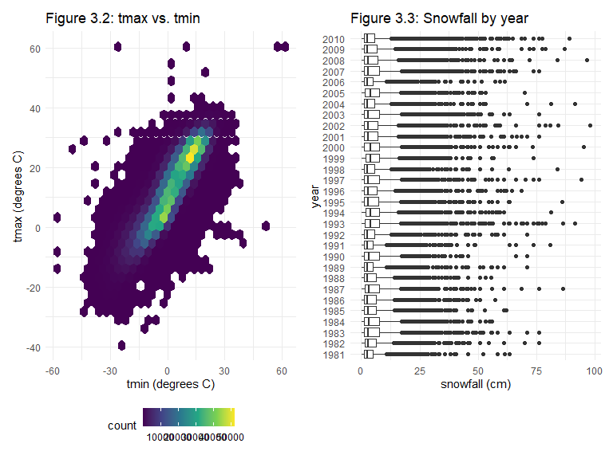

HW3
================
Xuesen Zhao
2022-10-08

``` r
library(tidyverse)
```

    ## ── Attaching packages ─────────────────────────────────────── tidyverse 1.3.2 ──
    ## ✔ ggplot2 3.3.6      ✔ purrr   0.3.4 
    ## ✔ tibble  3.1.8      ✔ dplyr   1.0.10
    ## ✔ tidyr   1.2.1      ✔ stringr 1.4.1 
    ## ✔ readr   2.1.2      ✔ forcats 0.5.2 
    ## ── Conflicts ────────────────────────────────────────── tidyverse_conflicts() ──
    ## ✖ dplyr::filter() masks stats::filter()
    ## ✖ dplyr::lag()    masks stats::lag()

``` r
library(ggridges)
library(patchwork)

knitr::opts_chunk$set(
    echo = TRUE,
    warning = FALSE,
    fig.width = 8, 
  fig.height = 6,
  out.width = "90%"
)

theme_set(theme_minimal() + theme(legend.position = "bottom"))

options(
  ggplot2.continuous.colour = "viridis",
  ggplot2.continuous.fill = "viridis"
)

scale_colour_discrete = scale_colour_viridis_d
scale_fill_discrete = scale_fill_viridis_d
```

``` r
library(p8105.datasets)
data("instacart")
```

The instacart data set is stored as a dataframe that contains 1384617
rows and 15 columns, where each row is a product from an order. Some
examples of the variables include add_to_cart_order which is the order
in which each product is added to the cart, order sequence number for
the user, order_dow which is the day of the week on which the order was
placed, the name of the product, aisle identified, etc. The head of the
data set is shown below:

``` r
head(instacart,n=4L)
```

    ## # A tibble: 4 × 15
    ##   order_id product_id add_to_c…¹ reord…² user_id eval_…³ order…⁴ order…⁵ order…⁶
    ##      <int>      <int>      <int>   <int>   <int> <chr>     <int>   <int>   <int>
    ## 1        1      49302          1       1  112108 train         4       4      10
    ## 2        1      11109          2       1  112108 train         4       4      10
    ## 3        1      10246          3       0  112108 train         4       4      10
    ## 4        1      49683          4       0  112108 train         4       4      10
    ## # … with 6 more variables: days_since_prior_order <int>, product_name <chr>,
    ## #   aisle_id <int>, department_id <int>, aisle <chr>, department <chr>, and
    ## #   abbreviated variable names ¹​add_to_cart_order, ²​reordered, ³​eval_set,
    ## #   ⁴​order_number, ⁵​order_dow, ⁶​order_hour_of_day

``` r
instacart %>% 
  group_by(aisle_id,aisle) %>%
  summarize(
    n_aisle = n(),
  ) %>% arrange(desc(n_aisle))
```

    ## `summarise()` has grouped output by 'aisle_id'. You can override using the
    ## `.groups` argument.

    ## # A tibble: 134 × 3
    ## # Groups:   aisle_id [134]
    ##    aisle_id aisle                         n_aisle
    ##       <int> <chr>                           <int>
    ##  1       83 fresh vegetables               150609
    ##  2       24 fresh fruits                   150473
    ##  3      123 packaged vegetables fruits      78493
    ##  4      120 yogurt                          55240
    ##  5       21 packaged cheese                 41699
    ##  6      115 water seltzer sparkling water   36617
    ##  7       84 milk                            32644
    ##  8      107 chips pretzels                  31269
    ##  9       91 soy lactosefree                 26240
    ## 10      112 bread                           23635
    ## # … with 124 more rows

There are a total of 134 aisles. Most items are ordered from the fresh
vegetables (#83) aisle.

``` r
instacart %>% 
  count(aisle) %>% 
  filter(n > 10000) %>% 
  mutate(aisle = fct_reorder(aisle, n)) %>% 
  ggplot(aes(x = aisle, y = n)) + 
  geom_point() + 
  labs(title = "Number of items ordered in each aisle") +
  theme(axis.text.x = element_text(angle = 60, hjust = 1))
```


The following table shows the three most popular items in the aisles
“baking ingredients”, “dog food care”, and “packaged vegetables”:

``` r
instacart %>% 
  filter(aisle %in% c("baking ingredients", "dog food care", "packaged vegetables fruits")) %>%
  group_by(aisle) %>% 
  count(product_name) %>% 
  mutate(rank = min_rank(desc(n))) %>% 
  filter(rank < 4) %>% 
  arrange(desc(n)) %>%
  knitr::kable()
```

| aisle                      | product_name                                  |    n | rank |
|:---------------------------|:----------------------------------------------|-----:|-----:|
| packaged vegetables fruits | Organic Baby Spinach                          | 9784 |    1 |
| packaged vegetables fruits | Organic Raspberries                           | 5546 |    2 |
| packaged vegetables fruits | Organic Blueberries                           | 4966 |    3 |
| baking ingredients         | Light Brown Sugar                             |  499 |    1 |
| baking ingredients         | Pure Baking Soda                              |  387 |    2 |
| baking ingredients         | Cane Sugar                                    |  336 |    3 |
| dog food care              | Snack Sticks Chicken & Rice Recipe Dog Treats |   30 |    1 |
| dog food care              | Organix Chicken & Brown Rice Recipe           |   28 |    2 |
| dog food care              | Small Dog Biscuits                            |   26 |    3 |

The following tables shows the mean hour of the day at which Pink Lady
Apples and Coffee Ice Cream are ordered on each day of the week:

``` r
instacart %>%
  filter(product_name %in% c("Pink Lady Apples", "Coffee Ice Cream")) %>%
  group_by(product_name, order_dow) %>%
  summarize(mean_hour = mean(order_hour_of_day)) %>%
  spread(key = order_dow, value = mean_hour) %>%
  knitr::kable(digits = 2)
```

    ## `summarise()` has grouped output by 'product_name'. You can override using the
    ## `.groups` argument.

| product_name     |     0 |     1 |     2 |     3 |     4 |     5 |     6 |
|:-----------------|------:|------:|------:|------:|------:|------:|------:|
| Coffee Ice Cream | 13.77 | 14.32 | 15.38 | 15.32 | 15.22 | 12.26 | 13.83 |
| Pink Lady Apples | 13.44 | 11.36 | 11.70 | 14.25 | 11.55 | 12.78 | 11.94 |

## Question 2

``` r
accel = read_csv("./data/accel_data.csv") %>%
  janitor::clean_names() %>% 
  mutate(
    weekday_weekend = ifelse(day %in% c("Monday","Tuesday","Wednesday","Thursday","Friday"),"weekday","weekend"),
    weekday_weekend = as.factor(weekday_weekend)
  )
```

    ## Rows: 35 Columns: 1443
    ## ── Column specification ────────────────────────────────────────────────────────
    ## Delimiter: ","
    ## chr    (1): day
    ## dbl (1442): week, day_id, activity.1, activity.2, activity.3, activity.4, ac...
    ## 
    ## ℹ Use `spec()` to retrieve the full column specification for this data.
    ## ℹ Specify the column types or set `show_col_types = FALSE` to quiet this message.

A weekday_weekend variable was added to the original data set to
indicate if that day is a weekday or a weekend day, and the resulting
data set contains 35 rows and 1444 columns. It includes variable such as
the week number, which day of the week it is, and the activity counts
for each minute of a 24-hour day starting at midnight.

The following table shows the total activities for each day, as
specified by which week it was in and which day of the week it was:

``` r
accel %>%
  pivot_longer(
    activity_1:activity_1440,
    names_to = "activity",
    values_to = "activity_count"
  ) %>% 
  group_by(week,day) %>%
  summarize(day_sum = sum(activity_count)) %>% 
  pivot_wider(
    names_from = "day",
    values_from = "day_sum"
  ) %>% 
  select(Monday,Tuesday,Wednesday,Thursday,Friday,Saturday,Sunday) %>%
  knitr::kable()
```

    ## `summarise()` has grouped output by 'week'. You can override using the
    ## `.groups` argument.
    ## Adding missing grouping variables: `week`

| week |    Monday |  Tuesday | Wednesday | Thursday |   Friday | Saturday | Sunday |
|-----:|----------:|---------:|----------:|---------:|---------:|---------:|-------:|
|    1 |  78828.07 | 307094.2 |    340115 | 355923.6 | 480542.6 |   376254 | 631105 |
|    2 | 295431.00 | 423245.0 |    440962 | 474048.0 | 568839.0 |   607175 | 422018 |
|    3 | 685910.00 | 381507.0 |    468869 | 371230.0 | 467420.0 |   382928 | 467052 |
|    4 | 409450.00 | 319568.0 |    434460 | 340291.0 | 154049.0 |     1440 | 260617 |
|    5 | 389080.00 | 367824.0 |    445366 | 549658.0 | 620860.0 |     1440 | 138421 |

As shown in the above table, there had not been a consistent trend over
the 5 weeks. Nevertheless, there were certain trend within each week.
For week 1 and 2, the total activities of each day gradually increased
until it peaked on either Sunday or Saturday. For week 3, the total
activities of each day started with the highest on Monday, and
fluctuated over the remaining of the week. For week 4 and 5, the total
activities on both Saturdays were extremely low, and the overall
activities of weekend was also much lower compared to that of the
weekdays.

``` r
accel %>%
  mutate(
    day=factor(day,levels = c("Monday", "Tuesday", "Wednesday","Thursday","Friday","Saturday","Sunday"))
    )%>%
  pivot_longer(
    activity_1:activity_1440,
    names_to = "activity",
    values_to = "activity_count"
  ) %>% 
  group_by(day_id,day) %>%
  summarize(day_sum = sum(activity_count)) %>%
  ggplot(aes(x=day_id,y=day_sum))+geom_line(aes(color=day))+labs(title="Figure 2.1: Total activities by days")
```

    ## `summarise()` has grouped output by 'day_id'. You can override using the
    ## `.groups` argument.


For most days of a week except for Sunday, the total activities were
increasing before day 10. For Monday, Saturday, and Sunday, the total
activities started to decrease after it reached its peak values. For
Tuesday, Thursday, and Friday, the total activities started to increase
again after reaching the minimum value. The change of total activities
for each Wednesday over these weeks was more gradual.

## Question 3

``` r
library(p8105.datasets)
data("ny_noaa")
```

The original data set ny_noaa contains 2595176 rows and 7 columns which
is stored as a tibble/dataframe. The data set contains information on
the date, ID for the New York state weather stations, and 5 core weather
variables including precipitation (tenths of mm), snowfall (mm), snow
depth (mm), maximum temperature and minimum temperature in tenths of
degree C. 19% of the original data set has missing values, which
constituted a relatively large proportion.

``` r
ny_noaa %>%
  janitor::clean_names() %>%
  separate(date, into = c("year","month","day"),sep = "-") %>%
  mutate(
    prcp = prcp / 10,
    tmax = as.numeric(tmax) / 10,
    tmin = as.numeric(tmin) / 10,
    snow = snow / 10
  ) %>% 
  group_by(snow) %>%
  summarize(
    n_snow = n()
  ) %>% 
  arrange(desc(n_snow))
```

    ## # A tibble: 282 × 2
    ##     snow  n_snow
    ##    <dbl>   <int>
    ##  1   0   2008508
    ##  2  NA    381221
    ##  3   2.5   31022
    ##  4   1.3   23095
    ##  5   5.1   18274
    ##  6   7.6   10173
    ##  7   0.8    9962
    ##  8   0.5    9748
    ##  9   3.8    9197
    ## 10   0.3    8790
    ## # … with 272 more rows

The maximum and minimum temperature were divided by 10 to give a unit of
degree Celsius. Precipitation values were also divided by 10 to give a
unit of mm instead of tenths of mm for better interpretability. Snowfall
was also divided by 10 to give a unit of cm. The most commonly observed
value for snowfall is 0 cm. It makes sense because for most of the time
there is no snow.

``` r
ny_noaa_clean = ny_noaa %>%
  separate(date, into = c("year","month","day"),sep = "-") %>%
  mutate(
    prcp = prcp / 10,
    tmax = as.numeric(tmax) / 10,
    tmin = as.numeric(tmin) / 10,
    snow = snow / 10,
    month=month.abb[as.numeric(month)]
  ) 


ny_noaa_clean %>%
  mutate(
    year = as.numeric(year)
  ) %>%
  filter(month=="Jan"|month=="Jul") %>%
  group_by(year,id,month) %>%
  summarize( 
    mean_tmax = mean(tmax)
  ) %>%
  ggplot(aes(x=year,y=mean_tmax,group=id))+geom_line()+labs(title = "Figure 3.1: Mean tmax in January and July \n for each station across years ",x="year", y ="mean tmax (degrees C)")+facet_grid(. ~ month)
```

    ## `summarise()` has grouped output by 'year', 'id'. You can override using the
    ## `.groups` argument.


Figure 3.1 showed the average max temperature in January and July for
each station across years, where each line represented a distinct subway
station. The temperature fluctuated across years, and the overall
temperature for a particular month (either January or July) was
contained within a certain range. There was no obvious outliers as shown
in the figure.

``` r
library(patchwork)
library(hexbin)
q3_fig_i = 
  ny_noaa_clean %>%
  ggplot(aes(x=tmin,y=tmax))+geom_hex()+labs(title = "Figure 3.2: tmax vs. tmin",x="tmin (degrees C)", y ="tmax (degrees C)")

q3_fig_ii = 
  ny_noaa_clean %>%
  filter(0<snow & snow<100) %>%
  group_by(year) %>%
  ggplot(aes(x=year,y=snow))+geom_boxplot()+labs(title = "Figure 3.3: Snowfall by year",x="year", y ="snowfall (cm)")+coord_flip()

q3_fig_i + q3_fig_ii
```



Figure 3.2 showed a hex plot of the maximum temperature versus minimum
temperature of each observation. Figure 3.3 showed the distribution of
snowfall values greater than 0 and less than 10 cm of each year.
